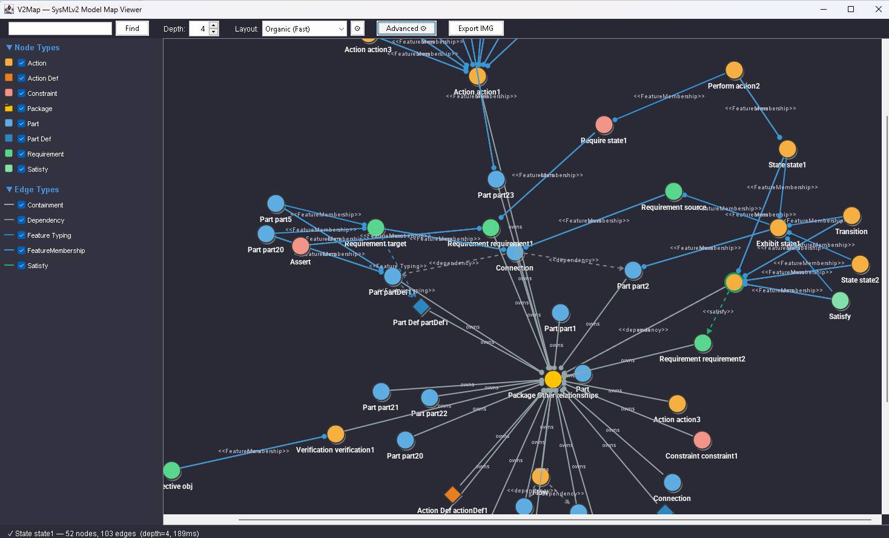

# V2MapScript
A Map Diagram for CATIA Magic (AKA Cameo) that demonstrates the Open API for SysMLv2 plugin.

This is for demonstration purposes only. In other words, this is not an officially supported capability or supported by Dassault in any shape, form, or fashion, warranty, or guarantee. Again, this is a demo, so unless you are doing the work, don't expect a lot of changes or requests. I am happy for people to create pull requests with their changes, but they need to be tested and complete. 

NOTE: This script requires 26xR1+ and may require the complete Groovy installation (we ship with minimal Groovy libraries).

The script is written in Groovy. 
## How to use
Once the script is launched from the tool, simply select an item in the containment tree. 
## Current Capabilities
- standard and compact views
- auto legend creation and editing
- several types of layout
- Ability to traverse package hierarchies
- Filter non-standard library elements/properties
- Customizations of view and layout parameters
- Export graph to SVG and PNG

